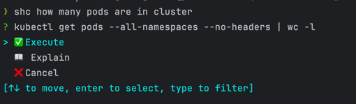

# Shell Chat: Elevate Your Command Line Experience

### **Enhance Your Command Line Workflows**

Welcome to ShellChat, your intelligent command-line assistant that transforms natural language requests into precise shell commands. Say goodbye to memorizing complex command syntax—simply describe what you need, and let ShellChat handle the rest.

### **Environment-Aware Functionality**

ShellChat is designed to be contextually aware of your operating system and shell environment, offering both automatic detection and manual configuration options. By default, ShellChat automatically detects your OS and shell, adapting the commands it generates to ensure they run seamlessly within your environment.

Alternatively, you can manually specify the operating system and shell by passing them as command-line parameters (-o, --os for the OS, and -s, --shell for the shell), or through environment variables (OS, SHELL). This dual approach provides maximum flexibility, ensuring that ShellChat is compatible with any setup, whether running locally, in containers, or on remote systems, enhancing the overall efficiency and reducing errors in command execution.

### **Flexible Language Support**

One of ShellChat's most powerful features is its ability to understand and process commands given in any natural language. Whether you prefer to work in English, German, or any other language, ShellChat can interpret your requests and generate the corresponding shell commands. The examples below demonstrate commands in both English and German, showcasing the tool's versatility.

### **Interactive TUI (Terminal User Interface)**

When you initiate a request via ShellChat's TUI, you will be presented with three options:

1. **Execute** - Run the suggested command immediately.
2. **Explain** - Get a detailed explanation of what the command does.
3. **Cancel** - Abort the suggested command if it does not meet your requirements.



To navigate through the options, use the arrow keys:
- **Up Arrow (↑)** - Move to the previous option.
- **Down Arrow (↓)** - Move to the next option.

Once you've made your selection, press `Enter` to confirm.

> Note:
In addition to these options, ShellChat offers a reverse mode, where you can provide an existing command to be analyzed and explained. To enable this mode, use the -e or --explain flag.  
ShellChat will break down the provided command and explain its purpose, syntax, and potential side effects, helping you better understand what the command will do before execution.

### **Architecture Overview**

ShellChat is built on a robust architecture consisting of two primary components:

1. **Server (shc-serve or Docker Image):**
   The server handles the sensitive configuration related to the AI provider, including access keys and other critical credentials. It acts as the central processing unit, interpreting user commands and securely managing interactions with the AI provider. The server is developed in Rust, making it exceptionally fast and performant.

2. **Client (shc):**
   The client is a lightweight interface that communicates with the server without needing direct access to the server's deployment. This separation ensures that sensitive data remains secure and inaccessible from the client side. The communication protocol is designed to support unlimited clients operating concurrently, allowing for scalable, parallel processing of commands. The client is also developed in Rust, contributing to its speed and reliability.

### **Examples**

Here are some examples of how ShellChat can help you translate your everyday tasks into efficient shell commands, in both English and German:

---

#### **Example 1: Counting Deployed Pods Across All Namespaces**

**Input:**
`shc list how many pods are deployed in all namespaces`

**Output:**
```shell
kubectl get pods --all-namespaces | grep -v NAME | wc -l
```

---

#### **Example 2: Display Pods in a Specific Namespace (German)**

**Input:**
`shc zeige pods in dem ollama namespace`

**Output:**
```shell
kubectl get pods -n ollama
```

---

#### **Example 3: Showing History of the Last 3 Git Commits**

**Input:**
`shc show history of last 3 commits`

**Output:**
```shell
git log -3
```

---

#### **Example 4: Displaying the Diff of the Last Commit (German)**

**Input:**
`shc zeige diff des letzten commit`

**Output:**
```shell
git log -1 --pretty=%H | xargs git diff
```

---

#### **Example 5: Showing Git User and Email of the Current Repo**

**Input:**
`shc show git user and email of the current git repo`

**Output:**
```shell
git config --get user.name && git config --get user.email
```

---

#### **Example 6: Listing the 10 Largest Files Recursively**

**Input:**
`shc list 10 larges files recursive`

**Output:**
```shell
find . -type f -exec du -h {} + | sort -rh | head -n 10
```

---

#### **Example 7: Listing All CSV Files**

**Input:**
`shc list csv files`

**Output:**
```shell
ls *.csv
```

---

#### **Example 8: Listing All CSV Files Recursively**

**Input:**
`shc list csv files recursive`

**Output:**
```shell
find . -type f -name "*.csv"
```

---

#### **Example 9: Showing the Last Pipeline Status on Gitlab**

**Input:**
`shc show Gitlab last pipeline status of gitlab host https://some_host and some_project `

**Output:**
```shell
curl -s --header "PRIVATE-TOKEN: <your_access_token>" "https://some_host/api/v4/projects/some_project/pipelines/latest" | jq '.status'
```

---

### **Conclusion**

ShellChat is the perfect tool for anyone who wants to streamline their command-line interactions across different languages. By converting natural language—whether it's English, German, or any other—into shell commands, it makes complex operations simple and accessible. Whether you're managing Kubernetes pods, checking Git histories, or exploring file systems, ShellChat is here to enhance your productivity.